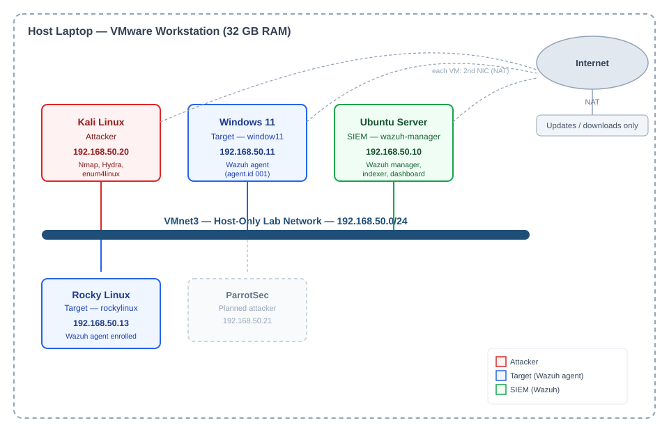

# Home SOC Lab — AI-Augmented Purple Team Detection Engineering

A self-built Security Operations Center: a Wazuh SIEM monitoring Windows and Linux endpoints on an isolated virtual network, with simulated attacks executed against it, mapped to MITRE ATT&CK, and an AI-assisted triage layer built on top — including an honest writeup of where that AI layer gets things wrong.

This isn't a single lab exercise. It's a running series of attack → detection → analysis cycles against a live environment I built and maintain myself.

## Architecture

| Host | Role | IP | Status |
|---|---|---|---|
| Ubuntu Server | Wazuh manager, indexer, dashboard | 192.168.50.10 | Active |
| Windows 11 | Target, Wazuh agent enrolled | 192.168.50.11 | Active |
| Rocky Linux | Target, Wazuh agent enrolled | 192.168.50.13 | Active |
| Kali Linux | Attacker | 192.168.50.20 | Active |
| ParrotSec | Second attacker | 192.168.50.21 | Planned |

All VMs sit on an isolated host-only network (VMnet3), separate from the real host network and internet — attack traffic never leaves the lab. Each VM has a second NAT adapter for package updates only.

## What's in this repo

- **`reports/`** — Detection reports for each attack technique tested: attack steps, raw Wazuh log evidence, and analyst-level MITRE ATT&CK verification (including correcting the SIEM's own auto-tagged techniques when they're wrong).
- **`scripts/`** — `soc_triage.py`, an AI-assisted alert triage tool (Groq/Llama 3.3 70B) that pulls Wazuh alerts and drafts a first-pass analyst summary, MITRE check, severity call, and next step. See `scripts/README.md` for a documented finding on where this tool's judgment fails and why.
- **`docs/`** — Architecture diagram and supporting documentation.
- **`screenshots/`** — Evidence for each exercise, organized by technique.

## Detection exercises completed

1. **SMB Enumeration** (`reports/Detection_Report_1_SMB_Enumeration.docx`) — Nmap SMB scan from Kali against Windows 11. Wazuh flagged the resulting anonymous NTLM logon, but auto-tagged it as Pass-the-Hash/RDP activity (T1550.002/T1021.001) — incorrect. Actual technique: T1046 (Network Service Discovery) / T1135 (Network Share Discovery). Full writeup covers catching and correcting that mismatch.

More exercises in progress — brute-force (Hydra), persistence, and privilege escalation, building toward one continuous multi-stage attack chain rather than isolated one-off techniques.

## Why this project is structured this way

Most home-lab writeups stop at "I ran a tool and got an alert." The goal here is closer to what an actual SOC analyst does day to day: run the SIEM's own tagging through a skeptical lens, verify it against the real attack timeline, and document where automated tooling — including the AI layer I built on top — gets things wrong, not just where it works.

## Tools used

VMware Workstation, Wazuh 4.14 (manager, indexer, dashboard), Windows 11, Rocky Linux, Ubuntu Server, Kali Linux, Nmap, Python, Groq API (Llama 3.3 70B).
